# Word Wide 
* [Live link](https://parduckids.github.io/milestone-project-two)
* [Wireframes and Sitemap](https://share.balsamiq.com/c/8obJqRrkHdLQWv489UPKAP.png)
* [GitHub Repository](https://github.com/parduckids/milestone-project-two)

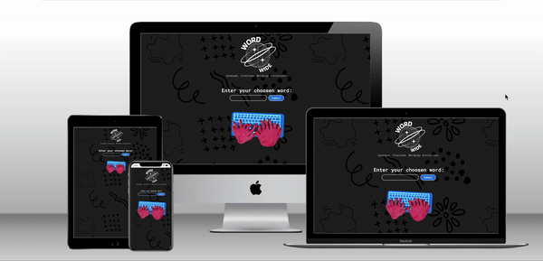

## The idea: 

* 'Word Wide' is a functional and minimalist synonym website. It stands out with a unique, quirky style, featuring animated background. Breaking away from the standard format of synonym sites; it provides word definitions, example words, synonyms based on user input, and even included a fun random word generator. I've used WordsAPI and Random Words API for synonyms and random words to make it interactive and engaging.

* This website has been created as my **Milestone Project 2** submission for the Code Institute's Diploma in Web Application Development course using HTML CSS and Javascript(jQuery). 

---

# User Experience:
## User Stories:

**Regular User**
* As a regular user, I want to be able to search for synonyms quickly, so I can find the right word efficiently while enjoying the quirky design.
* As a regular user, I want to see word definitions alongside synonyms so I can understand the word's context better.
* As a regular user, I want the option to explore similar words, helping me find alternatives that suit my writing style.

**Language Enthusiast**
* As a language enthusiast, I'd like the website to provide me with detailed word information, including etymology and usage examples, in a format that enhances my vocabulary exploration.
* As a language enthusiast, I want a "Random Word" feature to expand my word knowledge and challenge my language skills.

**Educator**
* As an educator, I need the website to be ad-free and straightforward to navigate, ensuring that students aren't distracted during their synonym searches while enjoying the website's engaging design.
* As an educator, I'd appreciate the ability to create lists of words and their synonyms for use in my teaching materials.

**Mobile User**
* As a mobile user, I want the website to maintain its design while ensuring smooth and responsive navigation on my smartphone, so I can access synonyms on the go and enjoy the unique experience.

---

# Design:

## Typography
* I use '[Roboto Mono]' throughout the website , which carries the same contemporary and unassuming design as the rest of the "Roboto" family. Its clean lines and minimalistic letterforms create a modern and professional appearance.
* The font is importad from [Google Fonts](https://fonts.google.com/)

## Imagery
**Typing Monster Gif:**

* Source: [Gifer](https://gifer.com)
* I used an animated gif of a playful and unique typing monster hand to encourage users to engage with the quirky design of the project.

**Background with Abstract Shapes:**

* I created the background image on [Canva](https://canva.com), a graphic design platform.
* The background features a dynamic composition of abstract shapes, providing a visually stimulating backdrop that complements the engaging design of the project with added css scrolling animation.

**Word Wide Logo:**

* Created with [Canva](https://canva.com)
* The logo features a globe, a star, and the text "Word Wide." This design plays on the word "worldwide," emphasizing the global reach of the synonym web application and adding a unique visual element to the project's branding.

**Favicon**
* 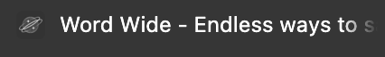

## Color scheme
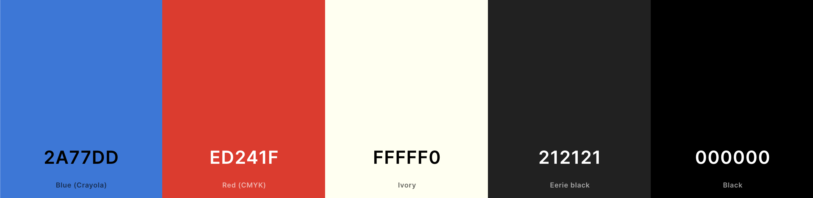
<!-- write about these colors and the choice  -->

## Animations and preloaders:

**Preloader with animated star gif:**

* To ensure that the loading time is less noticable and maintain the project's cohesive visual theme.
 

**Background animation:**
*  This animation uses keyframes to create the illusion of the background image moving down the page. By smoothly transitioning the background position, it adds a dynamic and visually appealing element to the design.

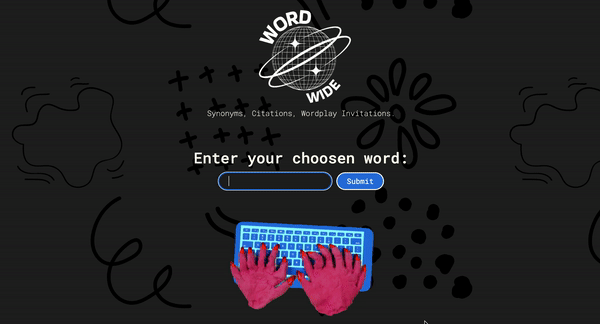

---

# Features
**Word Input:**
* Users can input a word of their choice into the application, making it easy to search for specific terms or explore new vocabulary.

* First load:
 
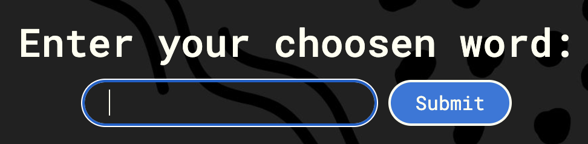

* From second load:
 
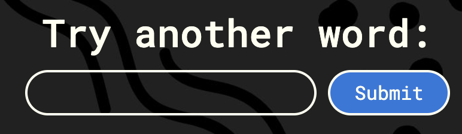

**Random Word Generation:** 
* Upon loading the application, a selection of intriguing and random words is presented. Users can click on these words to explore their meanings and usage.
 
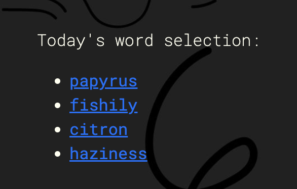

**Fetching Word Information:** 
* After a user submits a word, the application fetches comprehensive information about the term, including:

**Synonyms:** 
* The application provides a list of synonyms, helping users discover alternative words with similar meanings.
 
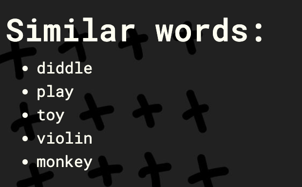

**Definitions:**
* Clear and concise definitions are offered, allowing users to gain a better understanding of the word's precise meaning and usage.
 
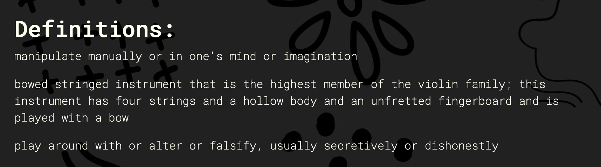

**Examples:**
* The application supplies usage examples, providing real-world context for the word's application in sentences.
 
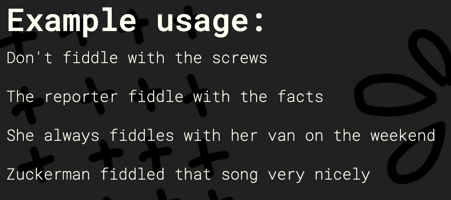

**User-Friendly Interface:** 
* The user interface is designed for simplicity and ease of use. After the word is submitted, the interface dynamically updates to display the entered word, its synonyms, definitions, and examples. This seamless transition enriches the user experience, making it easy for users to explore and understand the world of words.
 

# Deployment:

- The website built with the help of [gitpod template](https://github.com/Code-Institute-Org/gitpod-full-template)  that Code Institute provided for this project and [Gitpod](https://www.gitpod.io/) that is an online code editor provided by [Github](https://github.com/). 
- Using Github and Github Pages to create a live link for the website.

- Guide for running the code on [Gitpod](https://www.gitpod.io/)
  - 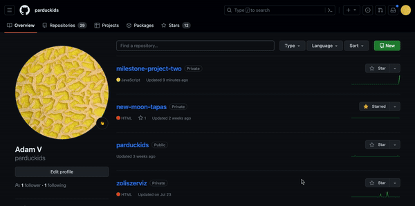

- Step by step guide for creating a live link with the help of [Github Pages](https://pages.github.com/)
  - 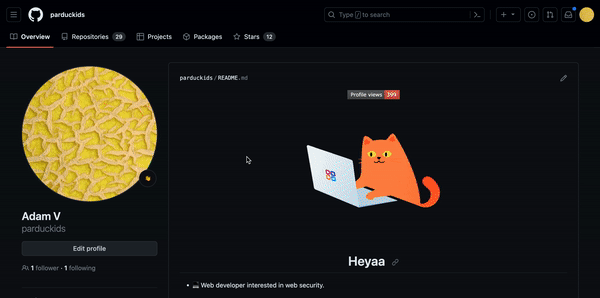
  

