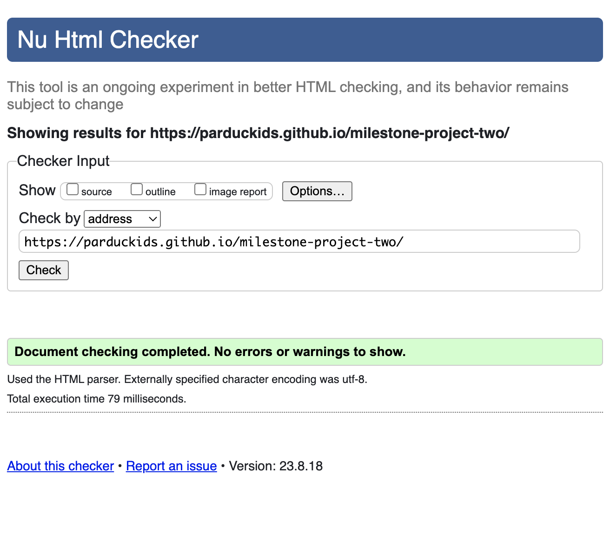

# Project Fixes and Tests Documentation

## Contents
- [1. Test Environment](#test-environment)
- [2. HTML, CSS, JS tests, lighthouse tests](#2-html-css-js-tests-lighthouse-tests)
- [3. Mobile Responsiveness Test](#3-mobile-responsiveness-test)
- [4. Testing User Stories](#4-testing-user-stories)
- [5. Manual Testing](#5-manual-testing-and-fixes)
- [6. Other Tests](#6-other-tests)
    - [JSHint](#javascript-validation-with-jshint)
- [**Conclusion**](#conclusion)

## Testing Procedure

### **Test Environment**
- **Physical Devices:**
  - Windows PC 
  - MacBook Pro 
  - iPhone 12 Mini
  - Google Pixel 5
  - iPad Pro

- **Browsers:**
    - Google Chrome
    - Mozilla Firefox
    - Safari
    - Microsoft Edge
    - Opera

### 2. **HTML, CSS, JS tests, lighthouse tests**

#### W3C HTML Validator
- All tests passed with [The W3C Markup Validation Service](https://validator.w3.org/)

#### W3C CSS Validator
- All tests passed with [The W3C CSS Validation Service](https://jigsaw.w3.org/css-validator/)

#### Lighthouse
Tested with [Lighthouse report](https://developer.chrome.com/docs/lighthouse/overview/)

### 3. **Mobile Responsiveness Test**

#### Google Chrome Developer Screen Sizes:

Testing Mobile responsiveness with the help of **[Google Developer Tools](https://developer.chrome.com/docs/devtools/)**

  - iPhone SE (750 x 1334)
  - iPhone XR (828 x 1792)
  - iPhone 12 Pro (1170 x 2532)
  - Pixel 5 (1080 x 2340)
  - Samsung Galaxy S8+ (1440 x 2960)
  - Samsung Galaxy S20 Ultra (1440 x 3200)
  - iPad Air (1640 x 2360 for 4th Gen)
  - iPad Mini (1536 x 2048 for 5th Gen)
  - Surface Pro 7 (2736 x 1824)
  - Surface Duo (1800 x 2700 per screen)
  - Galaxy Fold (1536 x 2152 for inner display)
  - Samsung Galaxy A51 (1080 x 2400) / A71 (1080 x 2400)
  - Nest Hub (1280 x 800)
  - Nest Hub Max (1280 x 800)
  
  - Iphone 12 mini physical device:

  
 
  

  - Ipad Pro physical device:

  

  

### 4. **Testing User Stories**

- Regular User:
    * Test the search bar for quick synonym results.
    * Ensure definitions appear with synonyms.
    * Check for today's word selection created successfully.
- Language Enthusiast:
    * Confirm detailed word info availability.
    * Check "Today's Word Selection" for random words
- Educator:
    * Make sure that it's ad-free and an easy to navigate site.
    * Test if the synonyms are correct, related to the searched word
- Mobile User:
    * Assess design and responsiveness on smartphones.
    * Make sure that the functionality stayed the sames as on desktop versions

### 5. **Manual testing and fixes**
- All of my manual testing can be found in a form of commit with a descriptive commit message, here is a list of the most important ones:
    * [Test: CSS and JS functionality with body bgcolor and alert](https://github.com/parduckids/milestone-project-two/commit/641890fe15c613cad6d23d667247460290cfcde3)
    * [Test: Check if the form input left empty](https://github.com/parduckids/milestone-project-two/commit/fd27f6f2bd361123a9594947bf76e3a76aba2723)
    * [Test: clear previous data from UI before displaying fetched data](https://github.com/parduckids/milestone-project-two/commit/912b7fe50f888bfa19838364e74757f95a998bb7)
    * [Test: if fetchSynonyms function retrieves and log API data based on input](https://github.com/parduckids/milestone-project-two/commit/13e55f04bb74ad65f9fed829048f77479a98c82d)
    * [Test: if fetchDefinitions function retrieves and log API data based on input](https://github.com/parduckids/milestone-project-two/commit/9bb28df7f3b5b1d310c4f84b1f61c50cfe25c630)
    * [Test: if fetchExamples function retrieves and log API data based on input](https://github.com/parduckids/milestone-project-two/commit/c4841273003927626f6d296e4366229d2d292926)
    * [Test: if generateRandomWords function retrieves and log API data based on input](https://github.com/parduckids/milestone-project-two/commit/589ba4c8635030aec4f4580f8d9eccc55a46b819)
    * [Fix: remove all console.error for security reasons, change it to an alert for better user experience](https://github.com/parduckids/milestone-project-two/commit/07b3628e6ad7e7cb4d92d4c2de4477f52e075944)
    * [Fix: error message wasn't visible enough, make the font-size larger](https://github.com/parduckids/milestone-project-two/commit/465d1338e06b7805b69c238fc0bdcc525c0dedb6)

    * [Fix: add error handling when the API responses are 404](https://github.com/parduckids/milestone-project-two/commit/0e673011d8b1522d6001290d64901bb1bea7a08b)

    * [Fix: add error handling for generateRandomWords function](https://github.com/parduckids/milestone-project-two/commit/abcca9d0dc7b58a376c9aec367643f8cb3b8b158)

    * [Fix: change fallback background color to a dark one for better UI experience](https://github.com/parduckids/milestone-project-two/commit/1ec0d00dc560586688bf3f9d6df2c24b21b43302)

    * [Fix: check if api is up and running at document load to prevent any errors](https://github.com/parduckids/milestone-project-two/commit/26d2741e90479a36b2258b19844e3220ca307c28)

    * [Test: simulation of an api error to check if the message is visible for the user](https://github.com/parduckids/milestone-project-two/commit/3021ff4cdb74d0dd0501c45b6b0deb02c56da449)
    
    

### 6. **Other Tests**

#### All javascript code has been tested with: **[Google Developer Tools](https://developer.chrome.com/docs/devtools/)** 

- Console Tab:
    * By displaying JavaScript errors and warnings for debugging.
    * Executing JavaScript code from the console .
- Setting Breakpoints in Sources Tab:
    * Click on line numbers to set breakpoints which pause code execution.
    * When paused, I inspected variables, the call stack, and other information in the right panel.
- Stepping Through Code

#### Javascript validation with [JSHint](https://jshint.com/):

- First Test:
 

 
    - Three warnings
        - Line 81   Unnecessary semicolon.
        - 168   Missing semicolon.
        - 332   Missing semicolon.
    - FIX:
        * [Remove semicolon from line 81, add it to line 168 and 332](https://github.com/parduckids/milestone-project-two/commit/8b60603b3e51c5918786f88491c25b8ff2d4426a)
 

 
    #### `fetchFromEntry` Function Notice:

    * The `fetchFromEntry` function, flagged by JSHint as unused, is actually invoked through inline event handling in the form's HTML `onsubmit` attribute. This direct invocation from the HTML bypasses the need for a direct call in the JavaScript file, hence JSHint's mistaken unused variable warning.

    #### One undefined variable "$"
    * The variable `$` , representing jQuery, is defined externally in the HTML file through the inclusion of the jQuery library. JSHint does not recognize this by default and will flag `$` as an undefined variable. To resolve this, the directive `/* global $ */` is added at the top of the JavaScript file, which informs JSHint that `$` is a global variable and prevents the undefined variable error.

## Conclusion

The project has been tested thoroughly on different devices and browsers. The results show that it works well and meets the needs of its users. The tests on the code (HTML, CSS, and JS) confirm that it's built correctly. Manual testing has also helped fix small issues along the way. Overall, the project is in good shape, but I'm always open to making it even better in the future based on feedback.
